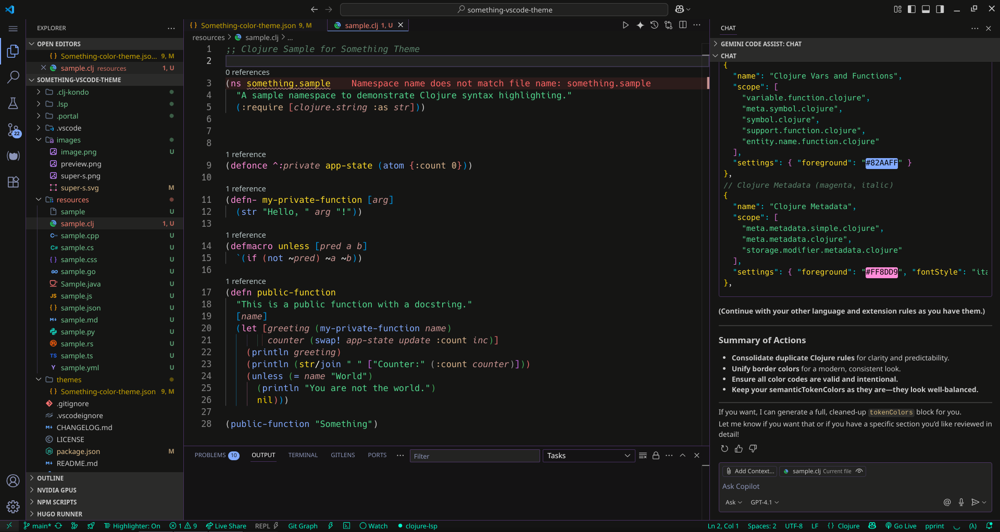

# Something Theme for Visual Studio Code

## Overview

A sleek, modern, and very dark theme for Visual Studio Code, where a deep, focused background meets vibrant pastel accents. "Something" is designed to be easy on the eyes while providing clear, beautiful, and simple syntax highlighting.

## Features

* **Deep Dark UI:** A unified, near-black background (`#0F0F0E`) across the editor, terminal, and sidebars to minimize distractions and keep your focus on the code.
* **Vibrant Pastel Palette:** Syntax highlighting is powered by a carefully selected set of pastel colors that are both beautiful and provide excellent readability.
* **Solid Accent Footer:** A solid pastel cyan status bar provides a clear and pleasant anchor for your workspace.
* **Subtle Borders:** Thin, pastel-colored borders gently separate UI elements without being distracting, keeping the interface clean and organized.
* **Comprehensive Styling:** From the integrated terminal and diff editor to peek views and merge conflict decorations, "Something" provides a consistent and immersive experience.
* **Broad Language Support:** Optimized for a wide range of popular languages including JavaScript, TypeScript, Java, Go, Rust, C/C++, C#, Python, Clojure, and more.

## Installation

1. Open the **Extensions** sidebar in VS Code (`Ctrl+Shift+X` or `Cmd+Shift+X`).
2. Search for `Something Theme`.
3. Click **Install**.
4. Open the **Command Palette** (`Ctrl+Shift+P` or `Cmd+Shift+P`), run `Preferences: Color Theme`, and select **Something Theme**.
5. Enjoy the experience!

## Feedback & Contributions

Find a bug or have a suggestion? Please open an issue on the GitHub repository.

Contributions are welcome!

## License

This theme is released under the GPLv3 License.

---

**Enjoy!**
